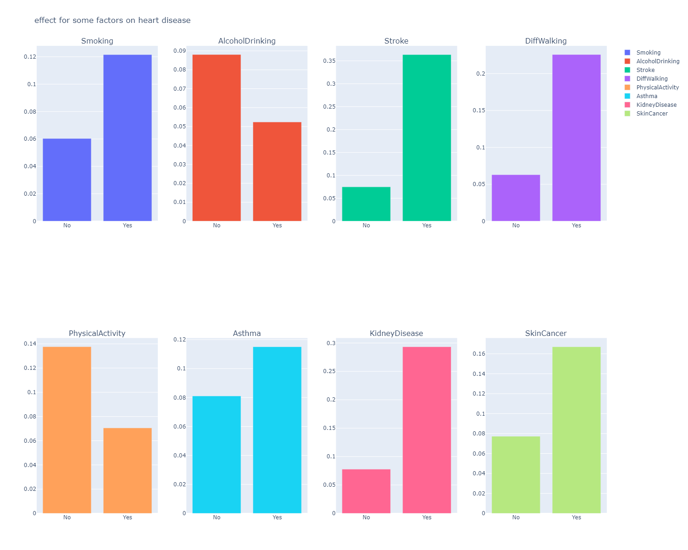

# heartDiseasePrediction

The purpose of this project is to predict the provability of having any heart disease base on the following [dataset ](https://www.kaggle.com/code/ahmedsta/heart-disease-prediction/data) using logistic regression and neural networks implemented by hand and using framework.

## Data understanding

### Data structure

* HeartDisease: Respondents that have ever reported having coronary heart disease (CHD) or myocardial infarction (MI)
* BMI: Body Mass Index
* Smoking: Have you smoke at least 100 cigarettes in your entire life [ 5 packs]
* AlcoholDrinking: Heavy drinkers ( adult men having more than 14 drinks per week and adult women having more than 7 drinks per week)
* Stroke: Ever told, you had a stroke
* PhysicalHealth: Now thinking about your physical health, which includes physical illness and injury, for how many days during the past 30
* MentalHealth: Thinking about your mental health, for how many days during the past 30 days was your mental health not good?
* DiffWalking: Do you have serious difficulty walking or climbing stairs?
* Sex: Are you male or female?
* AgeCategory: Fourteen-level age category
* Race:
* Diabetic:
* PhysicalActivity:
* GenHealth:
* SleepTime:
* Asthma:
* KidneyDisease
* SkinCancer:

### Data info

<class 'pandas.core.frame.DataFrame'>
RangeIndex: 319795 entries, 0 to 319794
Data columns (total 18 columns):

Column            Non-Null Count   Dtype

---

 0   HeartDisease      319795 non-null  object
 1   BMI               319795 non-null  float64
 2   Smoking           319795 non-null  object
 3   AlcoholDrinking   319795 non-null  object
 4   Stroke            319795 non-null  object
 5   PhysicalHealth    319795 non-null  float64
 6   MentalHealth      319795 non-null  float64
 7   DiffWalking       319795 non-null  object
 8   Sex               319795 non-null  object
 9   AgeCategory       319795 non-null  object
 10  Race              319795 non-null  object
 11  Diabetic          319795 non-null  object
 12  PhysicalActivity  319795 non-null  object
 13  GenHealth         319795 non-null  object
 14  SleepTime         319795 non-null  float64
 15  Asthma            319795 non-null  object
 16  KidneyDisease     319795 non-null  object
 17  SkinCancer        319795 non-null  object
dtypes: float64(4), object(14)
memory usage: 43.9+ MB

### Data head

|   | HeartDisease | BMI   | Smoking | AlcoholDrinking | Stroke | PhysicalHealth | MentalHealth | DiffWalking | Sex    | AgeCategory | Race  | Diabetic | PhysicalActivity | GenHealth | SleepTime | Asthma | KidneyDisease | SkinCancer |
| - | ------------ | ----- | ------- | --------------- | ------ | -------------- | ------------ | ----------- | ------ | ----------- | ----- | -------- | ---------------- | --------- | --------- | ------ | ------------- | ---------- |
| 0 | No           | 16.60 | Yes     | No              | No     | 3.0            | 30.0         | No          | Female | 55-59       | White | Yes      | Yes              | Very good | 5.0       | Yes    | No            | Yes        |
| 1 | No           | 20.34 | No      | No              | Yes    | 0.0            | 0.0          | No          | Female | 80 or older | White | No       | Yes              | Very good | 7.0       | No     | No            | No         |
| 2 | No           | 26.58 | Yes     | No              | No     | 20.0           | 30.0         | No          | Male   | 65-69       | White | Yes      | Yes              | Fair      | 8.0       | Yes    | No            | No         |
| 3 | No           | 24.21 | No      | No              | No     | 0.0            | 0.0          | No          | Female | 75-79       | White | No       | No               | Good      | 6.0       | No     | No            | Yes        |
| 4 | No           | 23.71 | No      | No              | No     | 28.0           | 0.0          | Yes         | Female | 40-44       | White | No       | Yes              | Very good | 8.0       | No     | No            | No         |

### Plotting the relation Heart Disease with the other parameters

